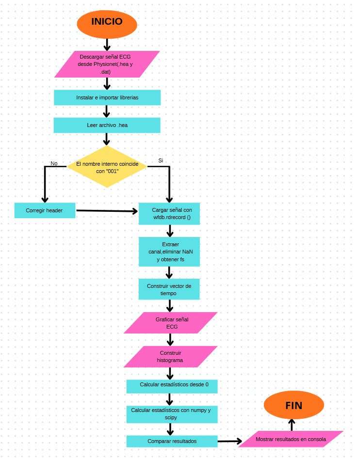

### INFORME DE LABORATORIO #1.
### ANALÍSIS ESTADÍSTICOS DE LA SEÑAL
### DESCRIPCIÓN 
En este repositorio se llevó a cabo el análisis de señales biomédicas empleando tanto datos obtenidos de bases de datos como señales adquiridas de manera experimental. Inicialmente, se descargó una señal fisiológica, la cual fue importada a Python para su visualización y para el cálculo de parámetros estadísticos relevantes.

Adicionalmente, se capturó una señal mediante un osciloscopio, utilizando un sistema DAQ para su adquisición, y posteriormente se compararon sus características con las de la señal previamente analizada. Finalmente, se evaluó la influencia del ruido en ambas señales a través del cálculo de la Relación Señal-Ruido (SNR), examinando cómo este afecta la calidad y el comportamiento de la señal.
## OBJETIVOS 
1. Seleccionar, importar y examinar señales fisiológicas con el fin de realizar su procesamiento y análisis estadístico en Python.
2. Emplear funciones predefinidas en Python junto con procedimientos manuales para comparar las características estadísticas de señales simuladas frente a señales reales.
3. Generar una señal fisiológica en el laboratorio, adquirirla mediante un sistema DAQ y evaluar sus propiedades estadísticas principales.
### PROCESAMIENTO 
## PARTE A 
En la Parte, se realizó el análisis estadístico de una señal biomédica con el fin de caracterizarla mediante parámetros descriptivos. Se seleccionó una señal ECG obtenida de la base de datos pública PhysioNet, correspondiente a atletas de resistencia de Noruega.La señal fue descargada, importada en Python y graficada en el dominio del tiempo para observar su morfología y comportamiento general.

Posteriormente, se calcularon los principales estadísticos descriptivos: media, desviación estándar, coeficiente de variación, histograma, asimetría (skewness) y curtosis. Estos parámetros se obtuvieron de dos maneras: implementando las fórmulas matemáticas desde cero y utilizando funciones predefinidas de Python.


## PARTE B 
En la Parte B del laboratorio se generó experimentalmente una señal fisiológica mediante el generador de señales biológicas y posteriormente se adquirió utilizando un sistema DAQ conectado al computador a través de un puerto USB y configurado con el controlador NI-DAQmx. El dispositivo recibió la señal analógica, la convirtió a formato digital mediante su conversor analógico-digital (ADC) y la almacenó en un archivo con extensión `.csv`, que contenía las columnas correspondientes al tiempo de muestreo y a los valores de amplitud. La señal fue importada en Python mediante el entorno Spyder, donde se verificó su integridad, se graficó en el dominio del tiempo y se construyó su histograma para analizar la distribución de amplitudes.

Posteriormente, se calcularon estadísticos descriptivos como la media, la mediana, la varianza muestral, la desviación estándar, el coeficiente de variación, la asimetría, la curtosis y los valores máximo y mínimo, con el fin de caracterizar globalmente la señal adquirida. Finalmente, estos resultados se compararon con los obtenidos a partir de la señal descargada de PhysioNet, permitiendo identificar similitudes estructurales y pequeñas diferencias atribuibles al ruido del sistema de adquisición, a la cuantización del ADC y a posibles interferencias del entorno experimental.


## SEÑAL ADQUIRIDA 


## CÓDIGO
# Carga y preprocesamiento de la señal
En esta etapa se importa la señal digitalizada generada por el sistema DAQ y almacenada en formato .csv. Se separan las variables de tiempo y amplitud, y se eliminan posibles valores no válidos (NaN) para garantizar la integridad del análisis estadístico. Finalmente, se determina el tamaño muestral 𝑁, el cual es relevante para el cálculo de los estimadores muestrales.

```
# PARTE B 
import pandas as pd
import numpy as np
import matplotlib.pyplot as plt
from scipy.stats import skew, kurtosis


# CARGAR SEÑAL ADQUIRIDA 
df = pd.read_csv("/content/medicion1.csv")

tiempo = df["timeStamps"].values
senal = df["data"].values

# Eliminar posibles valores NaN
mask = ~np.isnan(senal)
senal = senal[mask]
tiempo = tiempo[mask]

N = len(senal)

print("Número de muestras:", N)
```
# Visualización de la señal
La representación en el dominio del tiempo permite verificar la morfología y estabilidad de la señal adquirida experimentalmente. Esta validación visual es fundamental antes de proceder con el análisis estadístico.
```
# GRAFICA PRINCIPAL
plt.figure(figsize=(14,5))
plt.plot(tiempo, senal)

plt.title("Señal Fisiológica Generada y Adquirida",
          fontsize=16, fontweight='bold')

plt.xlabel("Tiempo (s)", fontsize=12)
plt.ylabel("Amplitud (V)", fontsize=12)

plt.grid(True, alpha=0.3)
plt.show()
```
# Análisis de distribución

El histograma no representa la señal en función del tiempo, sino que muestra la frecuencia con la que aparecen los distintos valores de amplitud dentro del conjunto de datos. Esta representación permite analizar la distribución estadística de la señal, identificando su nivel de dispersión, posible simetría o presencia de valores extremos. De esta forma, el histograma complementa la gráfica temporal y sirve como base para la interpretación de parámetros como la asimetría y la curtosis.
```
# HISTOGRAMA
plt.figure(figsize=(8,5))
plt.hist(senal, bins=60)

plt.title("Histograma de la Señal Adquirida",
          fontsize=14, fontweight='bold')

plt.xlabel("Amplitud")
plt.ylabel("Frecuencia")
plt.show()
```
# Gráfica  Histograma de la señal 


El histograma evidencia una distribución no uniforme con concentración principal alrededor de 1.1 V y presencia de valores extremos en torno a 0.8 V y 2.4 V. Esto sugiere una distribución multimodal asociada a los niveles característicos de la señal generada, así como posible asimetría positiva y presencia de picos de mayor amplitud.

# Cálculo de estadísticos descriptivos muestrales
En esta sección se calculan los principales estadísticos descriptivos. La media representa el valor promedio de amplitud. La varianza y la desviación estándar se estiman como muestrales (utilizando 𝑁−1), dado que se trabaja con datos experimentales. El coeficiente de variación permite analizar la dispersión relativa respecto a la media. Finalmente, la asimetría y la curtosis describen la forma de la distribución, indicando posibles sesgos o concentración extrema de valores.
```
# ESTADISTICOS DESCRIPTIVOS (MUESTRALES)

# Media
media = np.mean(senal)

# Desviación estándar muestral (N-1)
desv = np.std(senal, ddof=1)

# Varianza muestral
varianza = np.var(senal, ddof=1)

# Coeficiente de variación
coef_var = desv / media

# Asimetría
asimetria = skew(senal)

# Curtosis
curt = kurtosis(senal)
```
# RESULTADOS ESTADISTICOS DESCRIPTIVOS 


Los estadísticos descriptivos evidencian que la señal presenta un valor promedio de 1.22 V con una dispersión relativa del 33%. La alta asimetría positiva (2.5) y la curtosis elevada (4.69) indican una distribución no normal, caracterizada por la presencia de picos de alta amplitud que generan colas pesadas hacia valores superiores. Estos resultados son coherentes con el comportamiento observado en el histograma y reflejan la naturaleza no uniforme de la señal generada experimentalmente.


# PROCESAMIENTO 

## PARTE C
En esta seccion se tomo la señal del apartado anterior (La señal obtenida del generador de señales) para posteriormente agregarle diferentes tipos de ruido y finalmnete compararlas entre si.

### PROCEDIMIENTO
Para aplicar diferentes ruidos a una señal primero debemos partir de la base teórica de la relación entre una señal y el ruido (SNR), por ello entraremos a revisar primero conceptos para posteriormente aplicar los siguientes tipos de ruidos:
1.Ruido gaussiano
2.Ruido impulso
3.Ruido tipo artefacto

### ¿QUÉ ES SNR?
Cuando se habla del SNR, se refiere a la relación señal ruido, la cual en términos simples mide la intensidad de nuestra señal en relación con una interferencia no deseada que en este caso es un tipo de ruido el cual se puede definir como culquier alteración que cambie la calidad de nuestra señal. Usamos el SNR en distintos campos de la ingeniería para cuantificar la claridad de las señales, esta se suele representar como un valor numérico en decibelios (db) utilizando una escala logarítmica.

Para calcular el SNR se utiliza la siguiente expresión: 

$$
SNR = \frac{P señal}{Pruido}
$$
### FUNCIÓN PARA CALCULAR EL SNR
```python

def calcular_snr(signal, noise):
    potencia_senal = np.mean(signal**2)
    potencia_ruido = np.mean(noise**2)
    return 10 * np.log10(potencia_senal / potencia_ruido)

```
## CÓDIGO Y GRÁFICA

### RUIDO GAUSSIANO

#### CÓDIGO 

```python

sigma = 2 * np.std(senal)  # intensidad ajustable
ruido_gauss = np.random.normal(0, sigma, len(senal))

senal_gauss = senal + ruido_gauss
snr_gauss = calcular_snr(senal, ruido_gauss)

```
## RUIDO DE IMPULSO


#### CÓDIGO 
```python

senal_impulso = senal.copy()
ruido_impulso = np.zeros_like(senal)

prob = 0.05  # 1% de muestras afectadas
num_impulsos = int(prob * len(senal))

indices = np.random.choice(len(senal), num_impulsos, replace=False)
amplitud = 3 * np.std(senal)

for i in indices:
    valor = amplitud * np.random.choice([-1, 1])
    senal_impulso[i] += valor
    ruido_impulso[i] = valor

snr_impulso = calcular_snr(senal, ruido_impulso)


```


## RUIDO DE ARTEFACTO


#### CÓDIGO 
```python
baseline = 0.5 * np.sin(2 * np.pi * 0.5 * t)      # 0.5 Hz
interferencia = 0.2 * np.sin(2 * np.pi * 60 * t) # 60 Hz

ruido_artefacto = baseline + interferencia
senal_artefacto = senal + ruido_artefacto

snr_artefacto = calcular_snr(senal, ruido_artefacto)


```
